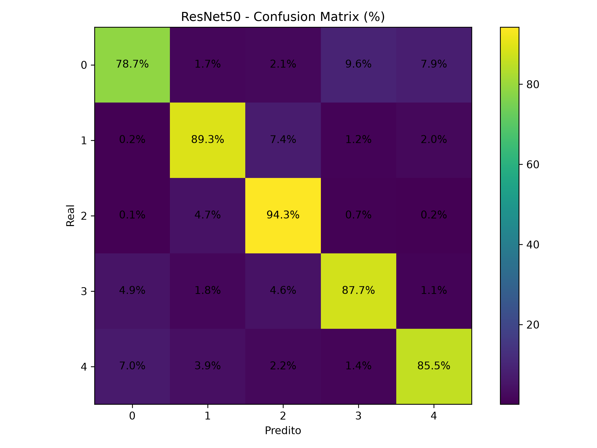
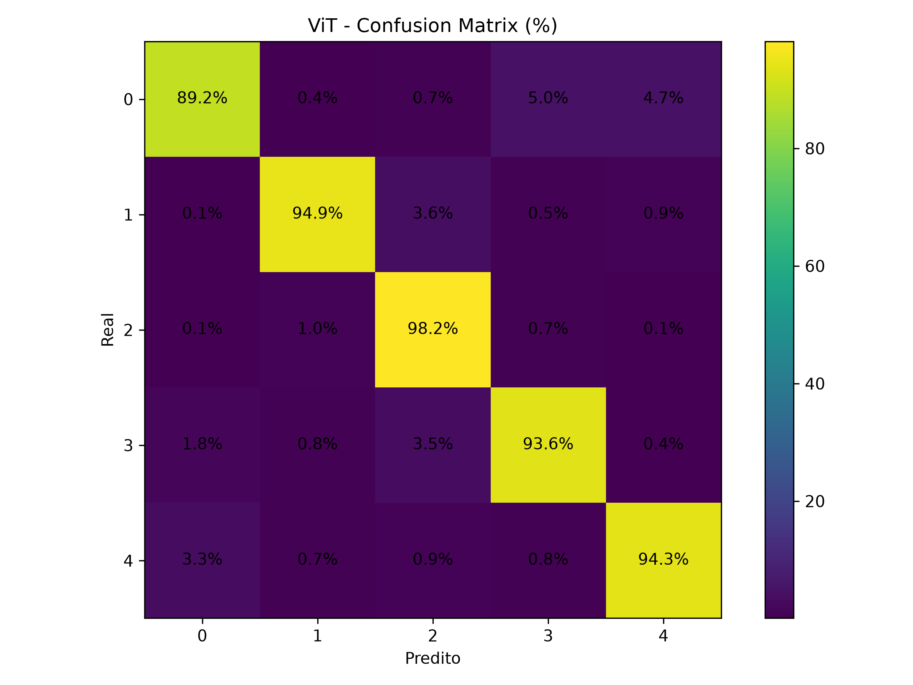

# 🌱 Soybean Seeds — Classificação com Extração de Features

## Configuração do Ambiente

Antes de executar o projeto, crie um ambiente virtual e instale as dependências.

### 1. Criar o ambiente virtual

```bash
python3 -m venv venv
```

### 2. Ativar o ambiente virtual

Linux/macOS:

```bash
source venv/bin/activate
```

Windows (PowerShell):

```powershell
venv\Scripts\Activate.ps1
```

### 3. Instalar as dependências

```bash
pip install --upgrade pip
pip install -r requirements.txt
```

### 4. Executar o pipeline completo

Extração de features:

```bash
python extract_features.py
```

Classificação e avaliação:

```bash
python classifiers.py
```
Classificação de sementes de soja utilizando features extraídas por dois backbones de deep learning (**ResNet50** e **ViT**), combinadas com 20 classificadores clássicos e um ensemble por votação suave.

---

## 📁 Estrutura do Dataset

```
Soybean Seeds/
├── Broken/
├── Immature/
├── Intact/
├── Skin-damaged/
└── Spotted/
```

---

## Pipeline Geral

```
Imagens (Soybean Seeds)
        ↓
extract_features.py  →  result_final_resnet50.csv
                     →  result_final_vit_large.csv
        ↓
classifiers.py
        ↓
20 modelos individuais  →  results_all.csv
        ↓
VotingClassifier (ensemble)  →  confusion_*.png + ensemble_*.csv
        ↓
merge_results()  →  results_ALL.csv
```

---

## Extração de Features (`extract_features.py`)

| Função | Descrição |
|---|---|
| `load_model()` | Carrega o backbone (ResNet50 ou ViT) e seu processador |
| `extract_features()` | Transforma cada imagem em um vetor numérico |
| `features_to_df()` | Itera sobre o dataset e constrói o DataFrame completo |
| `save_csv()` | Salva o DataFrame em CSV com colunas `image_path`, `label`, `feature_0`, `feature_1`, ... |

---

## Classificadores (`classifiers.py`)

Todos os modelos passam por um pipeline que normaliza os dados antes de classificar:

```
Pipeline
├── StandardScaler  →  normaliza features (média 0, desvio padrão 1)
└── Classificador   →  SVM / k-NN / MLP / RandomForest / DecisionTree / ...
```

> A normalização é essencial para modelos sensíveis à escala como SVM e k-NN, e é aplicada **dentro** da validação cruzada para evitar data leakage.

### Modelos utilizados (20 no total)

| Família | Modelos |
|---|---|
| SVM | `svm_rbf`, `svm_linear`, `svm_poly`, `svm_sigmoid` |
| k-NN | `knn3`, `knn5`, `knn7`, `knn11` |
| Random Forest | `rf50`, `rf100`, `rf200`, `rf300` |
| MLP | `mlp1` (50), `mlp2` (100,50), `mlp3` (200,100), `mlp4` (200,100,50) |
| Árvore de Decisão | `dt_inf`, `dt_d3`, `dt_d5`, `dt_d10` |

### Ensemble

O `VotingClassifier` com `voting="soft"` combina os 20 modelos calculando a **média das probabilidades** de cada classe e escolhendo a de maior valor — tornando o sistema mais robusto que qualquer modelo individual.

### Validação

- **Estratégia:** Stratified K-Fold com 10 folds
- **Métricas:** Acurácia e F1-Score (weighted), ambas em %

---

## 📊 Resultados Individuais — ResNet50

| Modelo | ACC (%) | F1 (%) |
|---|---|---|
| svm_linear | 86.76 | 86.72 |
| mlp1 | 86.94 | 86.90 |
| mlp2 | 86.92 | 86.86 |
| mlp4 | 86.65 | 86.60 |
| mlp3 | 86.49 | 86.44 |
| svm_rbf | 86.52 | 86.51 |
| svm_sigmoid | 86.31 | 86.26 |
| rf300 | 81.17 | 81.06 |
| rf200 | 80.75 | 80.64 |
| rf100 | 80.23 | 80.11 |
| rf50 | 78.76 | 78.65 |
| knn11 | 64.77 | 64.18 |
| knn7 | 65.90 | 65.46 |
| knn5 | 64.30 | 63.75 |
| knn3 | 64.19 | 63.89 |
| svm_poly | 63.63 | 62.87 |
| dt_d10 | 62.89 | 62.73 |
| dt_inf | 62.29 | 62.08 |
| dt_d5 | 59.01 | 58.81 |
| dt_d3 | 50.99 | 51.54 |
| **ensemble** | **87.41** | **87.34** |

---

## 📊 Resultados Individuais — ViT

| Modelo | ACC (%) | F1 (%) |
|---|---|---|
| mlp4 | 94.20 | 94.19 |
| svm_rbf | 94.21 | 94.20 |
| mlp1 | 94.16 | 94.15 |
| mlp3 | 94.07 | 94.07 |
| mlp2 | 94.00 | 93.99 |
| svm_poly | 93.34 | 93.34 |
| svm_sigmoid | 93.29 | 93.28 |
| svm_linear | 92.96 | 92.95 |
| rf200 | 89.66 | 89.64 |
| rf300 | 89.66 | 89.64 |
| rf100 | 88.66 | 88.65 |
| rf50 | 87.77 | 87.74 |
| knn7 | 86.09 | 86.17 |
| knn11 | 85.89 | 85.99 |
| knn5 | 85.80 | 85.86 |
| knn3 | 85.43 | 85.51 |
| dt_d10 | 71.43 | 71.36 |
| dt_inf | 71.36 | 71.25 |
| dt_d5 | 65.21 | 65.19 |
| dt_d3 | 60.58 | 60.64 |
| **ensemble** | **94.21** | **94.20** |

---

## Comparação entre Backbones

| Backbone | Melhor Modelo | ACC (%) | Ensemble ACC (%) |
|---|---|---|---|
| ResNet50 | mlp1 | 86.94 | 87.41 |
| ViT | svm_rbf | 94.21 | 94.21 |

O ViT superou o ResNet50 em todos os modelos, com ganho médio de aproximadamente **8 pontos percentuais** de acurácia.

---

## Matrizes de Confusão

### ResNet50 — Ensemble


### ViT — Ensemble


---

## 📂 Arquivos Gerados

| Arquivo | Conteúdo |
|---|---|
| `result_final_resnet50.csv` | Features extraídas pelo ResNet50 |
| `result_final_vit_large.csv` | Features extraídas pelo ViT |
| `results_individual.csv` | ACC e F1 dos 20 modelos individuais (ambos backbones) |
| `ensemble_ResNet50.csv` | ACC e F1 do ensemble ResNet50 |
| `ensemble_ViT.csv` | ACC e F1 do ensemble ViT |
| `results_all.csv` | Tudo junto: individuais + ensembles |
| `confusion_ResNet50.png` | Matriz de confusão do ensemble ResNet50 |
| `confusion_ViT.png` | Matriz de confusão do ensemble ViT |